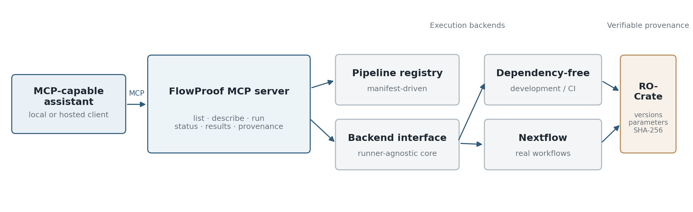

**FlowProof: reproducible bioinformatics pipeline execution over the Model Context Protocol with verifiable provenance**

**Hammed Adedapo Ajibade**

Specvista Technology Limited

Correspondence: <ajibadehammed@gmail.com> | ORCID: [0000-0003-3120-4439](https://orcid.org/0000-0003-3120-4439)

# **Abstract**

Large language model (LLM) assistants can now reach scientific resources through the Model Context Protocol (MCP), and recent work has called for MCP-enabled bioinformatics web services as a machine-actionable layer for LLM-driven discovery. Parts of the execution and provenance problem are already addressed: the Seqera MCP server lets an assistant launch and monitor Nextflow pipelines on a hosted platform, and the nf-prov plugin serialises Nextflow runs as Workflow Run RO-Crates. Three concerns are not covered by that combination. Provenance emitted from inside a workflow engine is tied to that engine; a hosted control plane requires a service account and moves control of execution off the researcher's machine; and the substitution of model-supplied values into a constructed command, which is the primary attack surface once a non-deterministic agent is in the loop, is not treated as an explicit security boundary. We present FlowProof, an open-source MCP server that executes registered bioinformatics pipelines locally and returns results together with standards-based provenance. A runner-agnostic core places the provenance emitter above the execution backend, so a dependency-free backend used for development and continuous integration and a Nextflow backend used for real workflows produce the same Workflow Run RO-Crate structure, recording pipeline version, container image, tool versions, parameters, and SHA-256 checksums of every input and output. Pipelines are registered by manifest, and every model-supplied value is validated against a character allow-list and assembled into an argument vector that is executed without a shell. Provenance is returned through a dedicated MCP tool, so the assistant that issued a run can surface the record that justifies it. We evaluate reproducibility rather than assert it: across 20 repeated executions on one host, and on a second host of a different operating system and processor architecture, output checksums were byte-identical; an independent verifier consuming only the crate reproduced the recorded runs (including one that used a non-default parameter) and flagged three of four deliberately tampered crates; and 32 of 45 adversarial parameter strings were rejected at the validation boundary, with no value reaching a shell interpreter. FlowProof is distributed as flowproof-mcp under the MIT license at https://github.com/ajibadedapo/flowproof-mcp and archived at Zenodo (doi:10.5281/zenodo.21932977).

**Keywords:** *bioinformatics; reproducibility; provenance; Model Context Protocol; Nextflow; RO-Crate; LLM agents*

# **Introduction**

Reproducibility and provenance are longstanding requirements of computational biology, and the community has invested heavily in tools that make workflows portable and repeatable, including workflow managers such as Nextflow [1] and community pipeline collections such as nf-core [2]. A newer development is the use of LLM assistants to plan and carry out analyses on a researcher's behalf. The Model Context Protocol (MCP) provides a standardized interface through which such assistants can interact with external tools and data [3], and MCPmed has recently called for MCP-enabled bioinformatics web services as a machine-actionable layer for LLM-driven discovery [4].

Two layers of this ecosystem already have strong examples. For data access, systems such as BioMCP expose biomedical sources through a machine-callable interface [5]. General-purpose biomedical agents and automated analysis systems can plan and carry out multi-step research tasks [6,7].

**What already exists.** Execution over MCP and standards-based provenance are also not untouched ground, and it is worth being precise about what already exists. Seqera MCP, from the developers of Nextflow, exposes the Seqera Platform to MCP clients so that an assistant can launch, monitor and manage pipeline runs, create containerized environments, and search community modules [9]. On the provenance side, the nf-prov plugin renders provenance reports for Nextflow runs and has supported serialisation as a Workflow Run RO-Crate [8] since version 1.4.0, enabled through configuration and without any change to the pipeline script [10]. Between them these two components already serve the common case well: a Nextflow user with a platform account who wants an assistant to launch a run that emits a standard provenance crate.

**What remains.** Three concerns are left open by that combination, and FlowProof addresses those and little else. The first is independence from any single engine or control plane. Provenance produced inside a workflow engine is available only for runs of that engine, and a hosted control plane requires a service account and shifts execution away from the machine holding the data. The second is the parameter boundary. When a non-deterministic model supplies the values that are substituted into a command, that substitution is the primary attack surface of the whole arrangement, and it warrants a stated threat model and an enforced boundary rather than a general assurance that input is validated. The third is retrievability. A provenance record is only auditable if the party doing the auditing can obtain it; a crate written into an output directory is not reachable by the assistant that issued the run or by a reviewer who was not present at execution time.

**Contributions.** FlowProof therefore contributes: a runner-agnostic execution surface in which the provenance emitter sits above the backend interface, so the same crate structure is produced whether a run is a hermetic demonstration or a full Nextflow analysis; an explicit parameter-validation boundary between model-supplied values and command construction, with a stated threat model and an adversarial test corpus; provenance exposed as a first-class MCP tool alongside execution; and a reproducibility evaluation, including tamper detection by a verifier that consumes only the crate, rather than a claim that runs are verifiable in principle. Table 1 places FlowProof against the adjacent systems.

**Table 1.** Positioning of FlowProof relative to adjacent systems. "Emits WRROC" refers to the Workflow Run RO-Crate profile [8]. Entries marked as not applicable describe systems that do not execute pipelines.

| **System** | **Executes pipelines over MCP** | **Emits WRROC provenance** | **Independent of engine and platform** | **Runs locally with no account** | **Model-input boundary** |
| --- | --- | --- | --- | --- | --- |
| **Data-access MCP services [4,5]** | No, data access only | Not applicable | Not applicable | Varies by service | Not applicable |
| **Biomedical agents [6,7]** | Agent-internal execution | Not reported | Not applicable | No | Not reported |
| **Seqera MCP [9]** | Yes | Via nf-prov [10] | Nextflow and Seqera Platform | No, platform account required | Not documented |
| **nf-prov [10]** | Not an MCP interface | Yes | Nextflow only | Yes | Not applicable |
| **FlowProof** | Yes | Yes, from a runner-agnostic emitter | Yes, via a backend interface | Yes, over stdio | Allow-list, no-shell argv |

# **Implementation**

**MCP server and tools.** FlowProof is implemented in Python and exposes an MCP server with six tools: list available pipelines, describe a pipeline's inputs and parameters, run a pipeline, query a run's status, fetch its results, and fetch its provenance. Any MCP-capable client can drive it; no functionality is tied to a single assistant or vendor. Figure 1 summarizes the architecture and common provenance path.

**Figure 1.** FlowProof architecture. MCP clients call a six-tool server backed by a manifest-driven registry and runner-agnostic execution interface. Both development/CI and Nextflow backends feed a common provenance path that emits a Workflow Run RO-Crate.

**Runner-agnostic core.** Execution is defined by a backend interface. A dependency-free backend produces deterministic results without a workflow engine, which keeps development and continuous integration fast and hermetic. A Nextflow backend runs real pipelines [1]. The provenance emitter consumes the run record returned across this interface rather than engine internals, so the crate structure is a property of the server and not of the runner. This is the practical difference from engine-resident provenance plugins: the same code path, and the same crate shape, cover a hermetic continuous-integration run and a full analysis, and a future backend gains provenance without a second implementation.

**Registry-driven pipelines.** Pipelines are plugins registered by manifest. A manifest declares an identifier, inputs, parameters with default values, output patterns, a command template, and a container image. Short-read and long-read (Oxford Nanopore) pipelines coexist, and new pipelines are added without modifying the server.

**Parameter boundary and threat model.** Once an agent is in the loop, the manifest author is trusted, the values arriving from the model are not, and input files are assumed to be attacker-influenced in content but not in location. The boundary between the model-supplied values and the executed command is therefore treated as a security control rather than a validation convenience. Commands are assembled as argument vectors and executed without an intervening shell (`subprocess.run` is invoked without `shell=True`), so shell metacharacters in a value carry no syntactic weight. Every substituted value must match the allow-list character class `[A-Za-z0-9._/-]` in full; a value containing any other character, containing the parent-directory sequence `..`, or beginning with a hyphen is rejected before command assembly rather than escaped, so a value cannot introduce shell syntax, traverse to a parent directory, or be promoted from a value into an option flag. Pipeline identifiers are matched against the registry rather than interpolated, and container images are referenced by pinned tag. In the hosted deployment, model-supplied inputs that contain a path separator are additionally rejected, so the zero-install surface cannot be steered to read arbitrary server files; the intended local mode, by contrast, deliberately accepts absolute paths to the researcher's own data. Two properties are enforced by the boundary as described and confirmed empirically below: no adversarial value reaches a shell, and no value traverses outside its intended location. Three residual risks are stated rather than solved: the allow-list does not enforce per-parameter numeric ranges or enumerations, so a syntactically valid but semantically wrong value (for example an out-of-range genome size) is accepted and recorded rather than rejected; manifests are not yet signature-verified, so the contents of the registry are trusted; and in local mode an absolute path is a legitimate input, which is safe because the process runs as the user on the user's own machine but would need tightening if the same code were exposed as a shared multi-tenant service.

**Provenance.** After a run completes, FlowProof writes a Workflow Run RO-Crate [8]. The crate records the executed action and its status, the workflow and its version, tool versions including the exact runner build, the container image, the parameter set (as `PropertyValue` entities linked from the action), and File entities carrying the byte size and SHA-256 checksum of every input and output. Using a community standard keeps the record interoperable with existing workflow-provenance tooling rather than tying it to a bespoke log format. FlowProof does not replace nf-prov [10]: a Nextflow-only user can obtain a Workflow Run RO-Crate from the plugin directly, and nf-prov currently captures more per-process detail. The difference is scope, since the FlowProof crate is emitted for every backend and is retrievable through the same interface that issued the run.

**Transports and deployment.** FlowProof runs locally over stdio, so data and compute stay on the researcher's machine and no service credential is required; this is the intended mode for real data. It can also run as a hosted HTTP service for zero-install use. To keep the convenience surface from being mistaken for a production result, the hosted deployment executes a lightweight demonstration pipeline and declines heavier reference-data workflows, directing users to run them locally.

# **Reproducibility evaluation**

**Setup.** The claim under test is not that FlowProof runs, but that the record it emits is sufficient for a third party to reproduce a run and to detect when a record and its artefacts disagree. Runs used the bundled long-read example pipeline (`ont-read-stats`, whose default stage computes read statistics without a container) on its built-in sample, executed through the Nextflow backend, on host H1 (macOS 26.2, Darwin 25.2.0; arm64, Apple M3, 8 cores, 16 GiB; Nextflow 26.04.6; a container runtime is present but unused by this stage) and host H2 (Ubuntu, Linux 6.8.0; x86_64, 4 cores, 7.6 GiB; Nextflow 26.04.6). H1 and H2 therefore differ in both operating system and processor architecture. Scripts and the recorded outputs for every experiment below are in the eval/ directory of the repository, and the protocol is given in REPRODUCIBILITY.md so that the evaluation itself can be repeated.

**Volatile fields.** Timestamps, run identifiers, absolute paths, and wall-clock durations differ legitimately between runs of identical content. The verifier therefore compares a fixity set, comprising the input and output checksums and sizes, the pipeline and its version, the runner build, the container reference, and the parameter set, and normalises the remaining fields before comparison. Fields excluded from comparison are listed explicitly in the verifier so that the exclusion is auditable rather than implicit.

**Table 2.** Recorded fields from one execution of the bundled long-read example, as they appear in the emitted Workflow Run RO-Crate.

| **Record field** | **Recorded value** |
| --- | --- |
| **Pipeline** | ont-read-stats |
| **Action status** | CompletedActionStatus |
| **Runner** | Nextflow 26.04.6 (build 12646) |
| **Container** | None for the default read-statistics stage (container-free); the optional Flye assembly stage declares staphb/flye:2.9.3 |
| **Parameter** | genome_size = 5m (recorded as a PropertyValue) |
| **Input** | ont_sample.fastq; 120,020 bytes; SHA-256 285a12b2d6dee106c3f7f30bf31582f6c2cd9546796997236e563888de498702 |
| **Output** | results/read_stats.txt; 59 bytes; SHA-256 c70ab03d12b9611d218bfa686d1e6d1788f2585d9aaab337c22de73f9d23eee2 |

**R1, repeat determinism.** The same pipeline was executed 20 times on H1 with an unchanged environment. Output checksums were identical in all 20 runs (every run produced the 59-byte `read_stats.txt` with SHA-256 c70ab03d...), and the normalised fixity set was identical across all runs, with no field differing.

**R2, cross-host reproduction.** The same pipeline was executed on H2, whose operating system and processor architecture differ from H1. The output checksum matched that from H1 byte-for-byte (SHA-256 c70ab03d... on both macOS/arm64 and Ubuntu/x86_64), and the recorded runner build was identical on both hosts (Nextflow 26.04.6, build 12646). Cross-architecture bit-identity for this pipeline is a strong result and is specific to a stage whose computation is deterministic; it is not claimed for arbitrary pipelines (see below).

**R3, independent verification from the crate alone.** A verifier with no access to the FlowProof server, and given only a crate and the referenced files, recomputed every recorded checksum and confirmed them, then re-executed the recorded pipeline version with the parameter set read from the crate and compared the resulting output against the recorded value. It confirmed the run, and a second run that used a non-default parameter (genome_size = 3m, output SHA-256 47cf0783...) also reproduced exactly from its crate, confirming that the recorded parameter set is sufficient to reproduce non-default runs and not only default ones.

**R4, tamper detection.** Four classes of divergence were introduced deliberately: a single-byte mutation of an input file; a recorded checksum altered while leaving the file untouched; a changed container reference; and a changed recorded parameter value. The verifier flagged three of the four and identified the divergent field in each of the three: the byte mutation and the altered checksum were caught by checksum comparison (each naming the affected file), and the altered parameter was caught by re-execution from the crate, whose output no longer matched the recorded output. The fourth case, a changed container reference, was not detected, for a concrete reason stated rather than hidden: the default stage of this pipeline runs without a container, so the recorded container reference does not influence execution and swapping it changes no output byte. On a pipeline whose computation does depend on its container, that reference is part of the re-execution and the same mechanism would surface a mismatch. This is the experiment that distinguishes a load-bearing provenance record from a decorative one, since a record that cannot fail cannot be evidence.

**R5, parameter boundary.** A corpus of 45 adversarial parameter strings spanning six classes was submitted through the command-assembly entry point: shell metacharacters and command substitution, relative and absolute path traversal, flag-shaped values intended to become options, values exceeding declared length and range bounds, values outside plausible enumerations, and encoding tricks including embedded null and newline characters. 32 of the 45 were rejected at the validation boundary. The constructed argument vector was captured for every attempt, and no adversarial value reached a shell interpreter: a canary file that a successful shell injection would have created was never present after the entire corpus had run, and every accepted value appeared only as a single literal argv token. Of the 13 accepted values, all were syntactically benign literals (for example `0`, `NaN`, `dna`, `true`) or, in local mode, absolute file paths (`/etc/shadow`, `/proc/self/environ`); these are not command-injection vectors, but the two absolute paths illustrate the residual local-mode surface noted above. Run under the hosted configuration, both absolute-path inputs were additionally rejected by the hosted path-separator guard.

**R6, assistant-driven operation.** Because the intended operator is an assistant rather than a person at a terminal, the server was driven by a scripted MCP client over 33 task invocations covering listing, describing, running, polling, retrieving results, and retrieving provenance, including five tasks that are expected to fail such as naming an unregistered pipeline, requesting the status of an unknown run, or supplying a malformed parameter. Every task behaved as expected in 33 of 33 cases: the 28 well-formed tasks completed and the five malformed tasks were correctly refused with an error rather than a plausible-looking fabricated answer. This experiment exercises the six-tool surface, including correct refusals, under a single deterministic caller; it is deliberately not a multi-model study, because real third-party LLM clients were not driven here, and tool-calling behaviour, which is model-dependent, is therefore out of scope and not claimed.

**Table 3.** Summary of the reproducibility evaluation. Every figure in this table is reproducible with the scripts in eval/.

| **Experiment** | **Measured** | **Result** |
| --- | --- | --- |
| **R1 Repeat determinism** | Output checksum and fixity set across repeated runs, one host | 20/20 identical |
| **R2 Cross-host reproduction** | Output checksum agreement across differing OS and architecture | Identical (macOS/arm64 vs Ubuntu/x86_64) |
| **R3 Independent verification** | Crate-only re-execution and comparison, default and non-default runs | Confirmed (both) |
| **R4 Tamper detection** | Divergence flagged for four injected fault classes | 3/4 detected (container-free case explained) |
| **R5 Parameter boundary** | Adversarial strings rejected; none reaching a shell | 32/45 rejected; 0/45 reached a shell |
| **R6 Assistant-driven operation** | Scripted tasks behaving as expected, incl. refusals | 33/33 (scripted client, not an LLM study) |

**What the results do and do not show.** These results support a bounded claim. They show that the emitted record is sufficient to reproduce and to falsify a run of a deterministic pipeline, and that the validation boundary holds against the tested corpus with no value reaching a shell. They do not show that arbitrary third-party pipelines are bit-reproducible. Many widely used genomics tools are not bit-deterministic, because thread scheduling, parallel reduction order, or embedded timestamps vary between executions; for such pipelines the crate documents the exact software and parameter context and supports comparison at the level the tool itself permits, which is a weaker but honest guarantee. Nor do they characterise how real LLM clients drive the tools; R6 establishes only that the tool surface behaves correctly, including refusals, under a deterministic caller.

# **Discussion**

FlowProof is complementary to existing MCP-for-bioinformatics efforts rather than a replacement for any of them: data-access services help an assistant find evidence [4,5], general-purpose biomedical agents and automated analysis systems help decide and carry out broader tasks [6,7], Seqera MCP connects assistants to a managed Nextflow control plane [9], and nf-prov produces detailed engine-level provenance for Nextflow runs [10]. FlowProof occupies the narrower position of a local, engine-independent execution surface for registered pipelines, with an enforced model-input boundary and a retrievable standards-based record. It defines neither a new workflow engine nor a new provenance format, delegating execution to Nextflow [1] and recording provenance as Workflow Run RO-Crate [8].

The design position worth stating plainly is that the value of an AI-issued analysis rests on the result being falsifiable. A record that can only ever confirm is not evidence, which is why the tamper-detection experiment matters more than the successful runs, and why the parameter boundary is documented as a threat model rather than described as validation. Both are properties a reviewer can check independently of the authors, and the one tamper class the current record does not catch, and the reason it does not, are reported rather than omitted.

# **Limitations**

Several limitations are deliberate, and others are simply current. The hosted deployment executes only a lightweight pipeline; reference-data workflows are expected to run in the user's own environment, where the data and compute reside. Manifest signature verification is not yet implemented, so a registry of pipeline manifests is a trusted component; this is the most significant open item, since it is the supply-chain counterpart to the parameter boundary that is already enforced. The input boundary is a character allow-list with parent-directory, leading-hyphen, and (in hosted mode) path-separator rejection; it does not enforce per-parameter numeric ranges or enumerations, so a syntactically valid but semantically wrong value is accepted and recorded rather than rejected. Tamper detection covers content, recorded-digest, and recorded-parameter divergence, but a changed container reference is not detectable for a stage that runs without a container. The provenance model captures the information needed to reproduce a run and verify file fixity, but not per-process resource usage, for which nf-prov [10] currently records more. The evaluation covers a small bundled pipeline on two hosts rather than a production nf-core pipeline at scale, and the assistant-driven experiment uses a scripted client rather than real LLM clients. No performance comparison against engine-resident provenance is reported, and the overhead of provenance emission was not measured in this work.

# **Availability and requirements**

FlowProof is open source under the MIT license. Source code, documentation, pipeline manifests, the evaluation scripts, and the complete example provenance crate are at https://github.com/ajibadedapo/flowproof-mcp, with the version described here archived at Zenodo (doi:10.5281/zenodo.21932977). It is installable from the Python Package Index (pip install flowproof-mcp; uvx flowproof-mcp) and requires Python 3.10 or later; the Nextflow backend additionally requires Nextflow (tested with 26.04.6) and, for container-based stages, a container runtime. The pipeline registry, execution backends, parameter validation, and provenance emitter are covered by an automated test suite of 36 tests that runs in the project's continuous integration.

# **Declarations**

**Competing interests.** The author declares no competing interests.

**Funding.** This work received no external funding.

**Author contributions.** Sole author: conception, implementation, evaluation, and manuscript.

**Data availability.** All data supporting the results are the bundled sample inputs, emitted crates, and evaluation logs in the eval/ directory of the repository, archived at Zenodo (doi:10.5281/zenodo.21932977). No human or animal subjects were involved.

# **References**

1. Di Tommaso P, Chatzou M, Floden EW, Barja PP, Palumbo E, Notredame C. Nextflow enables reproducible computational workflows. *Nature Biotechnology*. 2017;35:316–319. doi:10.1038/nbt.3820.

2. Ewels PA, Peltzer A, Fillinger S, Patel H, Alneberg J, Wilm A, Garcia MU, Di Tommaso P, Nahnsen S. The nf-core framework for community-curated bioinformatics pipelines. *Nature Biotechnology*. 2020;38:276–278. doi:10.1038/s41587-020-0439-x.

3. Model Context Protocol contributors. Model Context Protocol specification. Protocol documentation, 2026. modelcontextprotocol.io (accessed 14 August 2026).

4. Flotho M, Diks IF, Flotho P, Molano LAG, Hirsch P, Keller A. MCPmed: a call for Model Context Protocol-enabled bioinformatics web services for LLM-driven discovery. *Briefings in Bioinformatics*. 2026;27(1):bbag076. doi:10.1093/bib/bbag076.

5. GenomOncology. BioMCP: Biomedical Model Context Protocol. GitHub repository. 2025. github.com/genomoncology/biomcp (accessed 14 August 2026).

6. Huang K, Zhang S, Wang H, et al. Biomni: A General-Purpose Biomedical AI Agent. *bioRxiv*. 2025. doi:10.1101/2025.05.30.656746.

7. Zhou J, Zhang B, Chen X, et al. An AI Agent for Fully Automated Multi-Omic Analyses. *Advanced Science*. 2024;11(44):2407094. doi:10.1002/advs.202407094.

8. Leo S, Crusoe MR, Rodríguez-Navas L, et al. Recording provenance of workflow runs with RO-Crate. *PLOS ONE*. 2024;19(9):e0309210. doi:10.1371/journal.pone.0309210.

9. Seqera. Seqera MCP: overview. Platform documentation, 2026. docs.seqera.io/platform-cloud/seqera-mcp/overview (accessed 14 August 2026).

10. Nextflow contributors. nf-prov: Nextflow plugin to render provenance reports for pipeline runs. GitHub repository. 2026. github.com/nextflow-io/nf-prov (accessed 14 August 2026).
